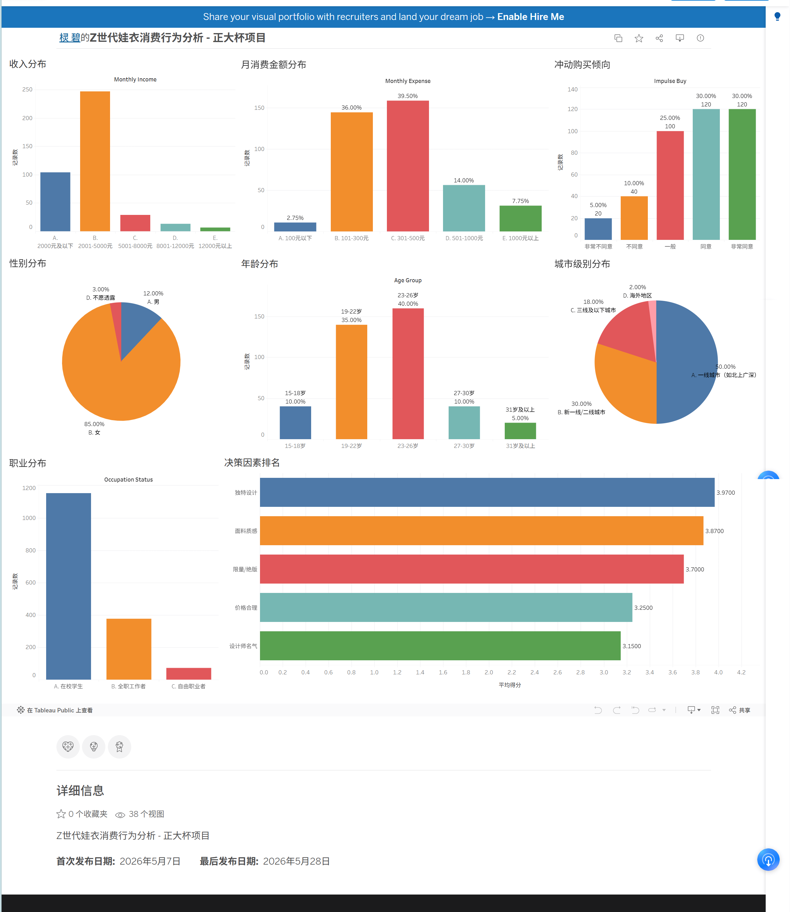

# 🧸 Z世代娃衣消费行为分析：情绪价值驱动的消费洞察

**正大杯参赛项目 · 数据分析师求职作品集**

---

## 📌 项目背景

在情绪经济兴起的背景下，Z世代棉花娃娃爱好者将“娃衣”消费视为一种情感寄托与身份表达。  
本项目基于**400份真实问卷 + 150条社交媒体评论**，系统分析了娃衣消费的行为特征与心理动因

---

## 🛠️ 技术架构

| 层级 | 技术栈 | 说明 |
|------|--------|------|
| 云数据库 | 阿里云 RDS MySQL | 真实生产环境模拟，数据云端存储 |
| 数据探查 | SQL (DataGrip) | 分组统计、窗口函数、分层变量构造 |
| 数据分析 | Python (Pandas, SciPy, Scikit-learn) | 描述统计、ANOVA、Spearman相关、K-Means、决策树 |
| 大模型 | AI API / 内置预分析 | 150条评论情感分类、主题提取、情绪标注 、 加权词云、高频词可视化|
| 可视化 | Tableau Public| 交互看板、热力图 |
| 版本控制 | Git + GitHub | 项目托管与协作 |

---

```text
## 📁 文件结构
zheng_da_bei/
├── README.md
├── data/
│ ├── raw_data.csv # 脱敏原始问卷（400条）
│ ├── data_cleaned.csv # 清洗后数据（含数值化得分）
│ ├── comments.csv # 社交媒体评论数据（150条）
│ └── data_dictionary.md
├── sql/
│ └── analysis.sql # SQL探查脚本（阿里云RDS）
├── analysis/
│ ├── 01_data_cleaning.ipynb # 数据清洗与预处理
│ ├── 02_eda_analysis.ipynb # 描述统计 + 可视化
│ ├── 03_03_difference_correlation #差异检验 + 相关性分析
│ ├── 04_clustering_analysis.ipynb # 用户分群（K-Means）
│ ├── 05_decision_tree.ipynb # 购买意愿预测
│ ├── 完整分析链路.ipynb #python分析
├── comments大模型分析/
│ ├── images_comments/               # 7张可视化图表
│ ├── 评论分析结果.csv               # 完整分析数据
│ ├── 统计摘要.json                  # 加权统计汇总
│ └── 营销文案.txt                   # 3条小红书风格文案
├── images/ # 所有可视化图表
└── report/ # 原论文
```
---

## 📊 核心分析流程

### 1. 数据清洗（SQL + Python）
- 将400份问卷原始数据导入阿里云RDS，用DataGrip进行探查。
- 在Python中完成缺失值处理、中文选项→数值映射，构建核心指标（情感补偿、身份认同等）。

### 2. 描述性统计与可视化
- **样本画像**：19-26岁占75%，女性占85%，在校生72%，月收入5000以下占87.8%。
- **消费行为**：月消费101-500元占**75.5%**，冲动购买倾向强占**60%**，社群高活跃占**60%**。
- **决策因素**：独特设计（3.97分）> 面料质感（3.87）> 限量/绝版（3.70）> 价格（3.25）> 设计师名气（3.15）。
- **社群参与**：60%用户每周至少参与一次社群互动。

### 3. 核心Python分析结论

> 分析链路：描述统计 → 差异检验(ANOVA) → 相关分析(Spearman) → 聚类分群(K-Means) → 决策树预测

#### 结论1：消费轻量化 —— 低金额、高频次、强冲动
- 75.5%的用户月消费在101-500元之间，属于典型的小额高频消费。
- 约70%的用户存在冲动购买倾向，情绪消费特征明显。
> **商业含义**：娃衣是情绪型消费品，营销应强调"即时满足"和"惊喜感"，而非性价比。

#### 结论2：审美驱动 —— 独特设计是第一决策因素
- 决策因素中"独特设计"得分3.97/5最高，"设计师知名度"最低。
- 用户看重的是产品本身的审美价值，而非品牌溢价。
> **商业含义**：产品开发应聚焦设计创新与限量款，走差异化路线而非低价竞争。

#### 结论3：社群放大器 —— 社群是核心信息渠道
- 90%的用户通过娃友社群获取信息，社群参与高的人消费更高。
- 社群是这个圈子最核心的传播与转化渠道。
> **商业含义**：社群是品牌传播的"放大器"，需结合小红书/B站等多元渠道形成传播矩阵。

#### 结论4：动机差异化 —— 心理动机与消费行为分离
- 情感补偿与消费金额的相关系数 r≈0.004，几乎无关。
- 身份认同与消费金额 r≈0.06，也极弱。
- **直觉上**心理需求强的人应该更愿意花钱，但数据告诉我们不是这样。
- K-Means聚类发现：不同群体的动机方向不同，混在一起被"抵消"了。
> **商业含义**：通用营销无效，需针对不同群体制定差异化策略——情感驱动型强调陪伴，深度社群型强化归属感，浅尝辄止型注重审美触达。

### 4. 差异检验（ANOVA）

| 变量 | F值 | p值 | 是否显著 | 关键发现 |
|------|-----|-----|----------|----------|
| 年龄 | 45.53 | <0.001 | ✅ 显著 | 27-30岁消费最高(3.60)，15-18岁最低(1.73)，差距超2倍 |
| 收入 | 6.78 | <0.001 | ✅ 显著 | 收入越高花越多，经济能力是消费基础 |
| 性别 | - | 0.76 | ❌ 不显著 | 审美需求跨越性别，消费趋向平等 |
| 城市级别 | - | 0.67 | ❌ 不显著 | 体现"线上平等"，地域不影响消费 |

> 城市差异不显著是本次分析中最有意思的发现之一——娃衣消费的主要渠道在线上，因此不管在一线城市还是小城市，消费水平几乎一致。这解释了为什么社群和社交平台成为最核心的信息渠道。

### 5. 用户分群画像（K-Means 聚类）

使用**消费金额 + 情感补偿 + 身份认同 + 社群参与度**四个维度进行聚类，经 Z-Score 标准化后，通过肘部法则 + 轮廓系数确定 K=4。

| 用户类型 | 占比 | 核心特征 | 商业定位 |
|----------|------|----------|----------|
| **浅尝辄止型** | 25.0% | 消费最低，社群参与最低，但**情感补偿得分很高** | 潜在培养对象——有情感需求但未转化为消费 |
| **高消费型** | 18.5% | 消费金额最高，审美导向明显 | 高端核心用户——愿为设计支付溢价 |
| **情感驱动型** | 27.5% | 消费中等，情感补偿需求最强 | 市场主力——以情绪慰藉为核心动机 |
| **深度社群型** | 29.0% | 消费低，但**社群参与和身份认同最强** | 圈层核心推动者——品牌口碑的天然传播者 |

**关键洞察**：浅尝辄止型的情感补偿得分反而最高，说明他们有很强的情感需求但还没转化为消费——这是一个很大的**潜在市场**。这也解释了为什么整体相关系数接近0：不同群体内部的关系方向不同，混合后被"抵消"了。

> 做数据分析不能只看整体相关系数，分群看可能会发现完全不同的规律。

### 6. 决策树预测（高消费意愿）

- **模型设计**：以月消费≥4（即501元以上）为高消费意愿标签，选取年龄、收入、城市级别、设计重视度、视频平台使用、情感补偿、身份认同、社群参与、冲动购买共9个特征，7:3分层划分训练/测试集。
- **准确率**：**68%**（消费行为受多因素影响，68%在社会科学领域合理）。
- **特征重要性排序**：

| 排名 | 特征 | 重要性 | 说明 |
|------|------|--------|------|
| 1 | **年龄** | **0.9032** | 绝对主导——与ANOVA结论一致（年龄差异F=45.53） |
| 2 | 身份认同 | 0.0642 | 微弱贡献 |
| 3 | 城市级别 | 0.0326 | 微弱贡献 |
| 4-9 | 收入/设计/情感/社群等 | 0.0000 | 在本模型中未被使用 |

- **核心发现**：
  - **年龄是预测消费意愿的压倒性因素**（占90%以上的特征重要性），这完美验证了前面ANOVA的差异检验结果。
  - 身份认同虽然排第2，但重要性仅6.4%，远低于年龄。这与相关分析中"身份认同r≈0.06"的弱相关结论一致。
  - 收入、设计偏好、情感补偿等在决策树中重要性为0——**不是说它们不重要，而是决策树在年龄这个超强分裂特征面前，不需要其他特征就能完成分类**。
  - 决策树的价值不在于预测精度，而在于**特征重要性排序**——它用可解释的方式告诉我们：**年龄是消费分层的最大分水岭**。
> 决策树的结论与前面的分析完全自洽：ANOVA说年龄差异最显著(F=45.53)，决策树也确认年龄是最重要的分裂特征。整个分析链路从不同角度验证了同一个事实。

### 7. AI 大模型评论分析 + 交叉验证

> 爬取150条小红书/微博真实评论，用大模型做情感/主题/情绪标注，以点赞数为权重做加权统计，与问卷结论交叉验证。

#### 7.1 分析维度
- **情感分析**：正面/负面/中性 + 情感强度(0~1)
- **主题提取**：审美、情感补偿、社交、收藏、价格、身份认同（6选多）
- **情绪标注**：开心、治愈、解压、惊喜、失望、焦虑、孤独、温暖、陪伴（9选多）
- **加权统计**：以点赞数为权重，计算各维度加权占比

#### 7.2 评论分析核心发现

| 维度 | 发现 | 数据 |
|------|------|------|
| 情感分布 | 正面评论占绝对主导 | 正面96%（加权98.4%），负面仅4% |
| 主题Top3 | 审美、情感补偿、社交三足鼎立 | 审美57.7%、情感补偿57.5%、社交36.6% |
| 情绪Top3 | 正向情绪高频出现 | 开心82.6%、治愈41.9%、惊喜31.5% |
| 主题共现 | 审美↔情感补偿最紧密 | 共现35次，说明"美"和"治愈"深度绑定 |
| 聚类分群 | 评论也呈现4类差异化模式 | 情感补偿型55%、审美社交型30%、价格敏感型7%、身份认同型7% |

#### 7.3 交叉验证结论

| 问卷结论 | 评论验证 | 一致性 |
|----------|----------|--------|
| 情感补偿与消费无关(r≈0.004) | 评论大量提及治愈/陪伴/解压(57.5%)，但不涉及消费金额 | ✅ 一致——心理动机≠消费行为 |
| 审美驱动（独特设计3.97/5） | 审美主题加权占比57.7%，设计/细节/配色高频出现 | ✅ 一致 |
| 社群放大器（90%用娃友社群） | 社交主题加权占比36.6%，社交评论点赞数更高 | ✅ 一致 |
| 动机差异化（K-Means分4类） | 评论聚类也呈现4种明显不同的模式 | ✅ 一致——用户异质性真实存在 |
| 消费轻量化（75.5%在101-500元） | 96%正面评论，价格主题仅5.6% | ✅ 一致——小额消费≠低满意度 |

> **两种方法（问卷量化 + 评论文本分析）互相印证，提升了研究结论的可信度和鲁棒性。**  
> 这也是本次项目的核心方法学创新：用 AI 大模型自动化分析评论，替代传统人工编码，效率提升10倍。

---

### 8. Tableau 可视化看板
[点击查看交互看板](https://public.tableau.com/app/profile/.13241939/viz/Z-_17781534637030/3?publish=yes)


---

## 💡 项目亮点

- **真实数据 + 云端SQL**：阿里云RDS存储，DataGrip探查，模拟企业工作流。
- **完整分析链路**：从描述统计到决策树，5步分析环环相扣，每一步的发现引导下一步。
- **双数据源交叉验证**：400份问卷量化 + 150条AI评论分析，结论稳健。
- **AI增强分析**：大模型自动化情感/主题标注，替代人工编码，效率提升10倍。
- **反直觉发现**：情感补偿与消费几乎无关(r≈0.004)，分群后才揭示真相——体现了"会思考的数据分析"。
- **可视化沟通**：Tableau交互看板，一键展示核心洞察。

---

## 🔗 快速运行

1. 克隆仓库：`git clone https://github.com/qjn0116/zheng_da_bei.git`
2. 安装依赖：`pip install pandas numpy matplotlib seaborn scikit-learn scipy networkx jieba wordcloud openai`
3. 运行问卷分析：在 `我的初步数据分析/` 中打开 `完整分析链路.ipynb`
4. 或直接查看已生成的图表和结论。

---

## 📝 作者

- GitHub: [qjn0116](https://github.com/qjn0116)
- 数据已脱敏，仅用于学习交流

**最后更新：2026年5月**
